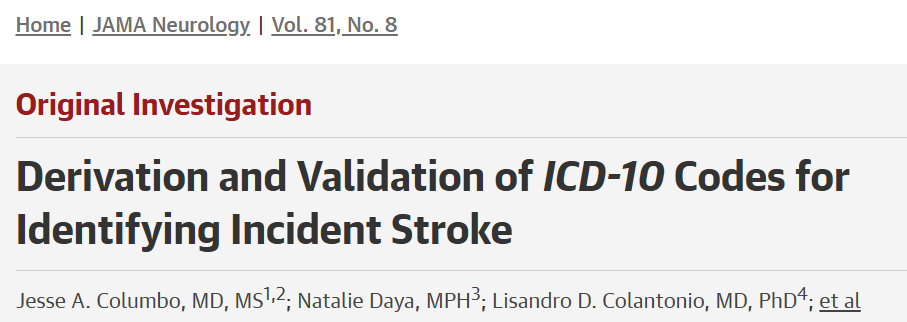
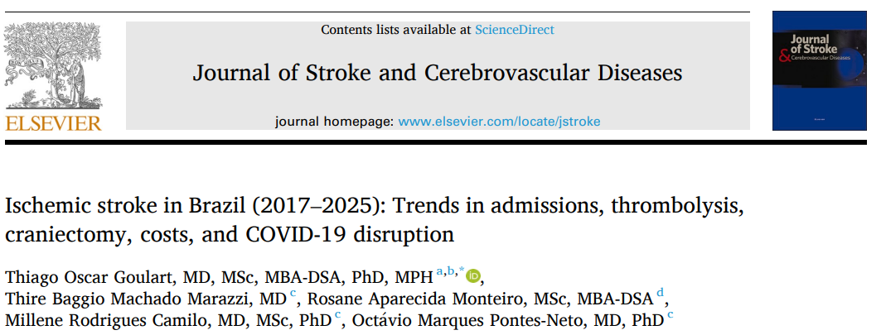
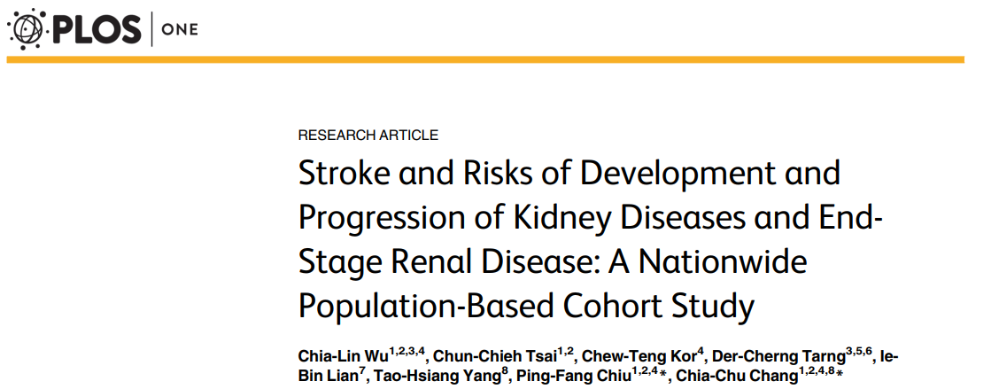
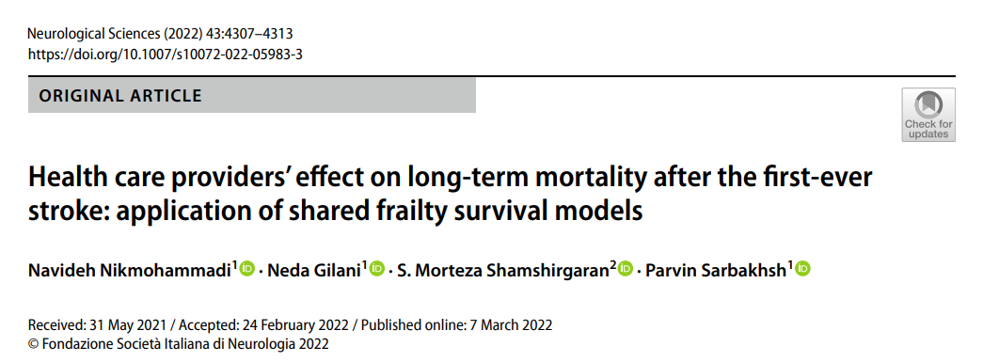
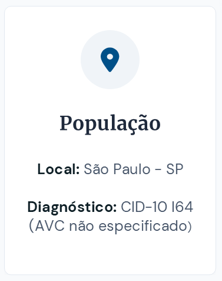
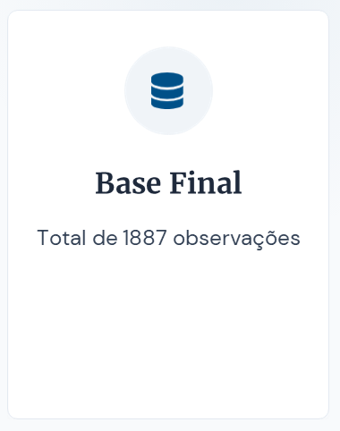
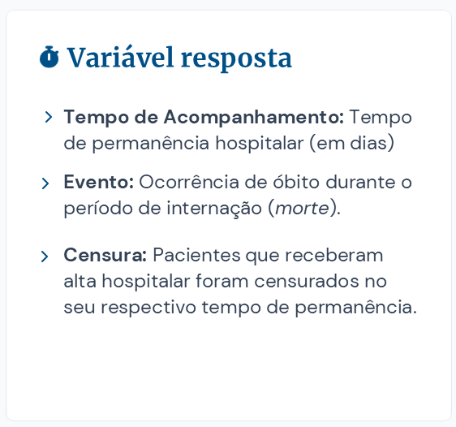

## 📋Sumário

<br>

:::{.columns}
:::{.column width="60%"}
:::{.fragment}
- Motivação
:::

:::{.fragment}
- Conjunto de dados
:::

:::{.fragment}
- Modelo de Cox com fragilidade
:::

:::{.fragment}
- Resultados e discussões
:::

:::{.fragment}
- Consideraçõs finais
:::

:::{.fragment}
- Principais referências
:::
:::

:::{.column width="40%"}

<br>

<div style="text-align: center;">

</div>
:::
:::

## 💡Motivação 

:::{.columns}
:::{.column width="33%"}
:::{.fragment}
<div style="text-align: center;">

</div>
:::
:::

:::{.column width="33%"}
:::{.fragment}
<div style="text-align: center;">

</div>
:::
:::

:::{.column width="33%"}
:::{.fragment}
<div style="text-align: center;">

</div>
:::
:::
:::

---

:::{.columns}
:::{.column width=50%"}
<div style="text-align: center;">

</div>
:::

:::{.column width="50%"}
<div style="text-align: center;">

</div>
:::
:::

:::{.fragment}
<div style="text-align: center;">

</div>
:::

---

:::{.columns}
:::{.column width=50%"}
<div style="text-align: center;">

</div>
:::

:::{.column width="50%"}
<div style="text-align: center;">

</div>
:::
:::

<div style="text-align: center;">

</div>

## 🗃️Conjunto de dados

<br>

:::{.columns}
:::{.column width="33%"}
:::{.fragment}
<div style="text-align: center;">

</div>
:::
:::

:::{.column width="33%"}
:::{.fragment}
<div style="text-align: center;">

</div>
:::
:::

:::{.column width="33%"}
:::{.fragment}
<div style="text-align: center;">

</div>
:::
:::
:::

## 🧱Construção da base de dados

:::{.columns}
:::{.column width="50%"}
:::{.fragment}
<div style="text-align: center;">

</div>
:::
:::

:::{.column width="50%"}
:::{.fragment}
<div style="text-align: center;">

</div>
:::
:::
:::

## 🧱Construção da base de dados

:::{.columns}
:::{.column width="33%"}
<div style="text-align: center;">

</div>
:::

:::{.column width="33%"}
:::{.fragment}
<div style="text-align: center;">

</div>
:::
:::

:::{.column width="33%"}
:::{.fragment}
<div style="text-align: center;">

</div>
:::
:::
:::

## 🧱Construção da base de dados

:::{.columns}
:::{.column width="33%"}
<div style="text-align: center;">

</div>
:::

:::{.column width="33%"}
:::{.fragment}
<div style="text-align: center;">

</div>
:::
:::

:::{.column width="33%"}
:::{.fragment}
<div style="text-align: center;">

</div>
:::
:::
:::

## 🔎Variáveis observadas

:::{.columns}
:::{.column width="50%"}
<div style="text-align: center;">

</div>
:::

:::{.column width="50%"}
:::{.fragment}
<div style="text-align: center;">

</div>
:::
:::
:::

## ⚙️Modelo de Cox com fragilidade

<br>

- Proposto por David Cox (1972), modela o tempo até o evento por meio da função de risco dada por

$$\lambda(t_i|X_i)=\lambda_0(t_i)\exp(X_i^{\top}\beta), i=1,\ldots,n$$
em que $\lambda_0(t)$ é a função de risco base, $X_i$ é o vetor de covariáveis e $\beta$ é o vetor de parâmetros desconhecidos.

---

```{=html}
<style>
  .network-wrapper {
    display: flex;
    justify-content: center; /* Centraliza horizontalmente o contêiner interno */
    align-items: center;    /* Centraliza verticalmente se houver altura extra */
    width: 100%;            /* Ocupa toda a largura disponível */
    background-color: transparent;
    border-radius: 12px;
    position: relative;
    overflow-x: auto;
    margin: 20px 0;
    font-family: 'Segoe UI', Tahoma, Geneva, Verdana, sans-serif;
    padding: 20px 0;
}

    .network-container {
        position: relative;
        min-width: 900px;
        height: 500px;
        margin: 0 auto;
    }

    .node {
        position: absolute;
        background: white;
        border-radius: 50%;
        display: flex;
        flex-direction: column;
        justify-content: center;
        align-items: center;
        box-shadow: 0 4px 15px rgba(0, 0, 0, 0.1);
        z-index: 2;
        transition: transform 0.3s ease;
        /* Centraliza o nó exatamente na coordenada definida pelos left/top */
        transform: translate(-50%, -50%); 
    }

    .node:hover {
        transform: translate(-50%, -50%) scale(1.1);
    }

    .hospital {
        width: 100px;
        height: 100px;
        border: 4px solid #3498db;
        animation: pulse 2s infinite alternate;
    }

    .patient {
        width: 70px;
        height: 70px;
        border: 3px solid #2ecc71;
        opacity: 0;
        animation: fadeIn 0.8s forwards;
    }

    .icon-h { font-size: 35px; }
    .icon-p { font-size: 25px; }
    
    .label {
        font-size: 10px;
        font-weight: bold;
        color: #333;
        margin-top: 2px;
        text-align: center;
    }

    /* Posições dos Hospitais */
    .h1 { left: 150px; top: 250px; }
    .h2 { left: 450px; top: 250px; }
    .h3 { left: 750px; top: 250px; }

    /* Posições dos Pacientes - Hospital 1 (3 pacientes) */
    .p1-1 { left: 150px; top: 80px;  animation-delay: 0.5s; }
    .p1-2 { left: 60px;  top: 400px; animation-delay: 1.0s; }
    .p1-3 { left: 240px; top: 400px; animation-delay: 1.5s; }

    /* Posições dos Pacientes - Hospital 2 (4 pacientes) */
    .p2-1 { left: 350px; top: 100px; animation-delay: 2.0s; }
    .p2-2 { left: 550px; top: 100px; animation-delay: 2.5s; }
    .p2-3 { left: 350px; top: 400px; animation-delay: 3.0s; }
    .p2-4 { left: 550px; top: 400px; animation-delay: 3.5s; }

    /* Posições dos Pacientes - Hospital 3 (3 pacientes) */
    .p3-1 { left: 750px; top: 80px;  animation-delay: 4.0s; }
    .p3-2 { left: 660px; top: 400px; animation-delay: 4.5s; }
    .p3-3 { left: 840px; top: 400px; animation-delay: 5.0s; }

    @keyframes fadeIn {
        from { opacity: 0; margin-top: 20px; }
        to { opacity: 1; margin-top: 0; }
    }

    @keyframes pulse {
        0% { box-shadow: 0 0 0 0 rgba(52, 152, 219, 0.6); }
        100% { box-shadow: 0 0 0 15px rgba(52, 152, 219, 0); }
    }

    .svg-lines {
        position: absolute;
        top: 0;
        left: 0;
        width: 100%;
        height: 100%;
        z-index: 1;
    }

    .connection-line {
        fill: none;
        stroke: #bdc3c7;
        stroke-width: 3;
        stroke-dasharray: 600;
        stroke-dashoffset: 600;
        animation: drawLine 1s ease forwards;
    }

    @keyframes drawLine { to { stroke-dashoffset: 0; } }

    .data-flow { 
        fill: #3498db; 
        opacity: 0; 
        animation: moveData 2s infinite linear;
    }

    @keyframes moveData {
        0% { offset-distance: 0%; opacity: 1; }
        100% { offset-distance: 100%; opacity: 0; }
    }
</style>

<div class="network-wrapper">
    <div class="network-container">
        
        <svg class="svg-lines" width="900" height="500">
            <!-- Linhas do Hospital 1 -->
            <path id="l1-1" class="connection-line" style="animation-delay: 0.8s;" d="M150,80 L150,250" />
            <path id="l1-2" class="connection-line" style="animation-delay: 1.3s;" d="M60,400 L150,250" />
            <path id="l1-3" class="connection-line" style="animation-delay: 1.8s;" d="M240,400 L150,250" />
            
            <!-- Linhas do Hospital 2 -->
            <path id="l2-1" class="connection-line" style="animation-delay: 2.3s;" d="M350,100 L450,250" />
            <path id="l2-2" class="connection-line" style="animation-delay: 2.8s;" d="M550,100 L450,250" />
            <path id="l2-3" class="connection-line" style="animation-delay: 3.3s;" d="M350,400 L450,250" />
            <path id="l2-4" class="connection-line" style="animation-delay: 3.8s;" d="M550,400 L450,250" />

            <!-- Linhas do Hospital 3 -->
            <path id="l3-1" class="connection-line" style="animation-delay: 4.3s;" d="M750,80 L750,250" />
            <path id="l3-2" class="connection-line" style="animation-delay: 4.8s;" d="M660,400 L750,250" />
            <path id="l3-3" class="connection-line" style="animation-delay: 5.3s;" d="M840,400 L750,250" />
            
            <!-- Fluxo de Dados Hospital 1 -->
            <circle class="data-flow" r="4" style="offset-path: path('M150,80 L150,250'); animation-delay: 1.8s;" />
            <circle class="data-flow" r="4" style="offset-path: path('M60,400 L150,250'); animation-delay: 2.3s;" />
            <circle class="data-flow" r="4" style="offset-path: path('M240,400 L150,250'); animation-delay: 2.8s;" />

            <!-- Fluxo de Dados Hospital 2 -->
            <circle class="data-flow" r="4" style="offset-path: path('M350,100 L450,250'); animation-delay: 3.3s;" />
            <circle class="data-flow" r="4" style="offset-path: path('M550,100 L450,250'); animation-delay: 3.8s;" />
            <circle class="data-flow" r="4" style="offset-path: path('M350,400 L450,250'); animation-delay: 4.3s;" />
            <circle class="data-flow" r="4" style="offset-path: path('M550,400 L450,250'); animation-delay: 4.8s;" />

            <!-- Fluxo de Dados Hospital 3 -->
            <circle class="data-flow" r="4" style="offset-path: path('M750,80 L750,250'); animation-delay: 5.3s;" />
            <circle class="data-flow" r="4" style="offset-path: path('M660,400 L750,250'); animation-delay: 5.8s;" />
            <circle class="data-flow" r="4" style="offset-path: path('M840,400 L750,250'); animation-delay: 6.3s;" />
        </svg>

        <!-- Hospitais -->
        <div class="node hospital h1">
            <div class="icon-h">🏥</div><div class="label" style="font-size: 16px;">Hospital 1</div>
        </div>
        <div class="node hospital h2">
            <div class="icon-h">🏥</div><div class="label" style="font-size: 16px;">Hospital 2</div>
        </div>
        <div class="node hospital h3">
            <div class="icon-h">🏥</div><div class="label" style="font-size: 16px;">Hospital 3</div>
        </div>

        <!-- Pacientes do Hospital 1 -->
        <div class="node patient p1-1"><div class="icon-p">🚶‍♀️</div></div>
        <div class="node patient p1-2"><div class="icon-p">🚶‍♀️</div></div>
        <div class="node patient p1-3"><div class="icon-p">🚶‍♀️</div></div>

        <!-- Pacientes do Hospital 2 -->
        <div class="node patient p2-1"><div class="icon-p">🚶‍♀️</div></div>
        <div class="node patient p2-2"><div class="icon-p">🚶‍♀️</div></div>
        <div class="node patient p2-3"><div class="icon-p">🚶‍♀️</div></div>
        <div class="node patient p2-4"><div class="icon-p">🚶‍♀️</div></div>

        <!-- Pacientes do Hospital 3 -->
        <div class="node patient p3-1"><div class="icon-p">🚶‍♀️</div></div>
        <div class="node patient p3-2"><div class="icon-p">🚶‍♀️</div></div>
        <div class="node patient p3-3"><div class="icon-p">🚶‍♀️</div></div>

    </div>
</div>
```

:::{.fragment}
::: {.callout-tip title="Fragilidade"}
Variável aleatória não observada associada a um
indivíduo ou grupo
:::
:::

---

O modelo de Cox com o termo de fragilidade é dado por

$$\lambda(t_i|X_i)=\lambda_0(t_i)Z_j\exp(X_{ij}^{\top}\beta), \quad j=1\ldots k\quad i=1,\ldots,n_j$$
Alternativamente, usando $Z_j = \exp(W_j)$, em que $W_j$ é o efeito aleatório aditivo:

$$\lambda(t | X_{ij}, W_j) = \lambda_0(t) \exp(X_{ij}^{\top} \beta + W_j)$$

## Estimação de parâmetros

**Fragilidade gama**

- Assume-se que a fragilidade $Z_j$ segue uma distribuição Gama com média 1 e variância $\theta$.

- A função de verossimilhança marginal para $k$ grupos é dada por

$$L(\beta, \theta) = \prod_{j=1}^k \int_{0}^{\infty} \left[ \prod_{i=1}^{n_j} L_{ij}(t_{ij} | Z_j) \right] f(z_j; 1/\theta, 1/\theta) dz_j$$

---

**Fragilidade normal**

- Assume-se que o efeito aleatório aditivo $W_i$ segue uma distribuição normal, $W_j \sim N(0, \sigma^2)$. Logo, $Z_j$ é log-normal.

- A função de verossimilhança marginal para $k$ grupos é dada por

$$L(\beta, \sigma^2) = \prod_{j=1}^k \int_{-\infty}^{\infty} \left[ \prod_{i=1}^{j_i} L_{ij}(t_{ij} | W_j) \right] \frac{1}{\sqrt{2\pi\sigma^2}} \exp\left(-\frac{w_j^2}{2\sigma^2}\right) dw_j$$

## Seleção de modelos

- **Modelo Cox**

$$AIC = -2l(\theta)+2p,$$
em que $p$ é o númerod e parâmetro.

- **Modelo de Cox com fragilidade gama**

$$AIC = -2l(\theta)+2df,$$
em que $df$ é o graus de liberdade efetivos.

---

- **Modelo de Cox com fragilidade normal**

$$AIC = -2(l_{pen}(\theta)-penalidade)+2df,$$
em que $l_{pen}(\theta)$ é o logaritmo da função de verossimilhança penalizada

## 🗨️Resultados e discussões

```{r}
#pacotes
library(geobr)
library(sf)
library(ggplot2)
library(viridis)
library(survival)
library(survminer)
library(coxme)
```


```{r}
#| results: hide

#importar dados
dat <- readxl::read_xlsx('internacoes_sp_intermediario.xlsx')
dplyr::glimpse(dat)

df <- dat |> 
  dplyr::filter(idade>=18)
```

```{r}
#Municipio de SP
sp <- read_municipality(
  code_muni = "SP",
  year = 2022,
  simplified = TRUE)

sao_paulo <- sp |> 
  dplyr::filter(name_muni == "São Paulo")
```

```{r}
#dados dos hospitais
hospitais <- data.frame(
  CNES = c("2077426", 
"2077523", 
"2077639", 
"2079240",  
"2080346", 
"2080583", 
"2080788",  
"2091585", 
"3212130",  
"5718368"),
  efeito = c(-0.36743036,
-0.20746240,
-0.33473968,
0.11577971,
-0.33567868,
-0.02317528,
0.52245317,
-0.19013488,
0.12741551,
0.69297288),
  hospital = c("Hospital Geral Henrique Altimeyer",
  "Hospital Ipiranga (UGA II)",
    "Hospital Municipal Prof. Dr. Waldomiro de Paula",
    "Hospital Geral Jesus Teixeira da Costa",
    "Hospital Municipal Dr. Cármino Caricchio",
    "Hospital Municipal Tide Setúbal",
    "Hospital Municipal Dr. Alexandre Zaio",
    "Hospital Estadual de Sapopemba",
    "Hospital Municipal Ver. José Storopolli",
    "Hospital Municipal Dr. Moysés Deutsch"),
  latitude = c(-23.592910,
-23.584164,
-23.530896,
-23.552628,
-23.532943,
-23.496977,
-23.542828,
-23.610957,
-23.522231,
-23.691461),
  longitude = c(-46.560152,
-46.611576,
-46.444486,
-46.404636,
-46.566382,
-46.440314,
-46.502122,
-46.492811,
-46.561918,
-46.774921))
```

```{r}
#coordenadas 
hospitais_sf <- st_as_sf(
  hospitais,
  coords = c("longitude", "latitude"),
  crs = 4326)
```

```{r}
#transformar tudo para UTM 235
# SIRGAS 2000 / UTM 23S
sao_paulo_utm <- st_transform(
  sao_paulo,
  crs = 31983)

hospitais_utm <- st_transform(
  hospitais_sf,
  crs = 31983)
```

:::{.columns}
:::{.column width="50%"}

```{r}
#| fig-align: center
#| fig-width: 10
#| fig-height: 8

ggplot() +
  # Município de São Paulo
  geom_sf(data = sao_paulo_utm,
    fill = "gray95",
    color = "gray30",
    linewidth = 0.7) +
  # Hospitais
  geom_sf(data = hospitais_utm,
    aes(color = CNES),
    size = 6,
    alpha = 0.9) +
  # CNES
  labs(title = "Localização dos hospitais na cidade de São Paulo",
    #subtitle = "Identificação por código CNES",
    caption = "Fonte: geobr/IBGE; coordenadas geográficas dos hospitais") +
  theme_minimal() +
  theme(axis.title = element_blank(),
    panel.grid = element_line(color = "gray90"),
    legend.position = "right",
    plot.title = element_text(size = 20),
    legend.title = element_text(size = 18),
    legend.text = element_text(size = 17))
```
:::

:::{.column width="50%"}
:::{.fragment}

```{r}
df_cnes <- df |>
  dplyr::group_by(cnes) |> 
  dplyr::count(morte, name='contagem')
```

```{r}
dados_total <- df_cnes |> 
  dplyr::group_by(cnes) |> 
  dplyr::summarise(total = sum(contagem))
```

```{r}
#| fig-align: center
#| fig-width: 10
#| fig-height: 8

#Mostrar quantos pacientes existem em cada hospital.
dados_total |> 
  ggplot() +
  aes(x = reorder(factor(cnes), total),
      y = total) +
  #geom_col(fill = "#56B4E9") +
  geom_col(fill = "slategray") +
  coord_flip() +
  labs(title = "Número de pacientes em cada hospital",
    x = "CNES",
    y = "Número de pacientes") +
  theme_minimal() +
  theme(plot.title = element_text(size = 20),
    axis.title = element_text(size = 19),
    axis.text = element_text(size = 18))
```
:::
:::
:::

---

```{r}
df_cnes |> 
  dplyr::group_by(cnes, morte) |> 
  dplyr::summarise(contagem = sum(contagem), .groups = "drop") |> 
  dplyr::group_by(cnes) |> 
  dplyr::mutate(porcentagem = (contagem / sum(contagem)) * 100) |> 
  dplyr::ungroup() |> 
  dplyr::filter(morte == 1) |> 
  dplyr::mutate(
    destaque = dplyr::case_when(
      porcentagem == max(porcentagem) ~ "Maior",
      porcentagem == min(porcentagem) ~ "Menor",
      TRUE ~ "Outros")) |> 
  ggplot() +
  aes(x = reorder(cnes, porcentagem), y = porcentagem, fill = destaque) +
  geom_col(width = 0.7) +
  coord_flip() +
  geom_text(aes(label = paste0(round(porcentagem, 1), "%")),
            size = 5) +
  scale_fill_manual(values = c(
    "Maior" = "#D55E00",  
    "Menor" = "#7570B3", 
    "Outros" = "#E0E0E0")) +
  scale_y_continuous(expand = expansion(mult = c(0, 0.15))) +
  labs(title = "Porcentagem de falhas em cada hospital",
       x = "CNES",
       y = "Porcentagem de falha (%)",
       fill = NULL) +
  theme_minimal() +
  theme(legend.position = "none",
  plot.title = element_text(size = 25),
    axis.title = element_text(size = 15),
    axis.text = element_text(size = 15))
```

---

```{r}
#| output: false

df |> 
  dplyr::count(cor) |> 
  dplyr::mutate(porcentagem = (n / sum(n)) * 100)

df |> 
  dplyr::count(sexo) |> 
  dplyr::mutate(porcentagem = (n / sum(n)) * 100)

df |> 
  dplyr::count(uti) |> 
  dplyr::mutate(porcentagem = (n / sum(n)) * 100)
```

<table style="border-collapse: collapse; width: 100%; text-align: left; margin: 0 auto; border-bottom: 1px solid black;">
  <caption style="font-size: 1.2em; padding-bottom: 12px;">
    Tabela - Perfil demográfico e clínico da amostra
  </caption>
  <thead>
    <tr style="background-color: #f2f2f2; border-bottom: 1px solid black;">
      <th style="padding: 10px;">Variável</th>
      <th style="padding: 10px;">Categoria</th>
      <th style="padding: 10px; text-align: center;">Frequência (%)</th>
    </tr>
  </thead>
  <tbody>
    <!-- Seção Sexo -->
    <tr style="border-bottom: 1px solid #cccccc;">
      <td rowspan="2" style="padding: 10px; font-weight: bold; border-bottom: 1px solid black;">Sexo</td>
      <td style="padding: 10px;">Feminino</td>
      <td style="padding: 10px; text-align: center;">48,5</td>
    </tr>
    <tr style="border-bottom: 1px solid black;">
      <td style="padding: 10px;color: blue;">Masculino</td>
      <td style="padding: 10px;text-align: center; color: blue;">51,5</td>
    </tr>
    
    <!-- Seção Cor ou Raça -->
    <tr style="border-bottom: 1px solid #cccccc;">
      <td rowspan="2" style="padding: 10px; font-weight: bold; border-bottom: 1px solid black;">Cor</td>
      <td style="padding: 10px;">Branco</td>
      <td style="padding: 10px;text-align: center;">44,0</td>
    </tr>
    <tr style="border-bottom: 1px solid black;">
      <td style="padding: 10px;color: blue;">Não branco</td>
      <td style="padding: 10px;text-align: center;color: blue;">56,0</td>
    </tr>

    <!-- Seção UTI -->
    <tr style="border-bottom: 1px solid #cccccc;">
      <td rowspan="2" style="padding: 10px; font-weight: bold; border-bottom: 1px solid black;">Uso de UTI</td>
      <td style="padding: 10px;">Sim</td>
      <td style="padding: 10px;text-align: center;">14,3</td>
    </tr>
    <!-- ÚLTIMA LINHA: Borda inferior forçada nas células -->
    <tr>
      <td style="padding: 10px; border-bottom: 1px solid black;color: blue;">Não</td>
      <td style="padding: 10px; border-bottom: 1px solid black;text-align: center;color: blue;">85,7</td>
    </tr>
  </tbody>
</table>

---

<!--
:::{.columns}
:::{.column width="50%"}
```{r}
#| echo: false
#| fig-align: center
#| fig-width: 8
#| fig-height: 7

df |>
  ggplot() +
  aes(x = sexo,
    y = idade,
    fill = sexo) +
  geom_boxplot(alpha = 0.8, width = 0.6) +
  scale_fill_manual(values = c(
    "Masculino" = "#7570B3",  
    "Feminino" = "#D55E00")) +
  labs(title = "Distribuição da idade segundo o sexo biológico",
    x = NULL,
    y = "Idade (anos)") +
  theme_minimal() +
  theme(legend.position = "none",
  plot.title = element_text(size = 23),
    axis.title = element_text(size = 22),
    axis.text = element_text(size = 22))
```
:::

:::{.column width="50%"}
:::{.fragment}

```{r}
#| echo: false
#| fig-align: center
#| fig-width: 8
#| fig-height: 7

df |> 
  ggplot() +
  aes(x = cor,
    y = idade,
    fill = cor) +
  geom_boxplot(alpha = 0.8, width = 0.6) +
  scale_fill_manual(values = c(
    "Não branco" = "#7570B3",  
    "Branco" = "#D55E00")) +
  labs(title =  "Distribuição da idade segundo a cor",
    x = "Cor",
    y = "Idade (anos)") +
  theme_minimal() +
  theme(legend.position = "none",
  plot.title = element_text(size = 23),
    axis.title = element_text(size = 22),
    axis.text = element_text(size = 22))

```
:::
:::
:::

---
-->

:::{.columns}
:::{.column width="50%"}
```{r}
#| fig-align: center
#| fig-width: 8
#| fig-height: 7

df |>
  ggplot() +
  aes(y = idade) +
  geom_boxplot(fill = "gray80",  
    color = "gray30",  
    width = 0.5) +
  labs(title = "Distribuição da idade",
    y = "Idade (anos)") +
  theme_minimal() +
  theme(legend.position = "none",
  plot.title = element_text(size = 23),
    axis.title = element_text(size = 22),
    axis.text = element_text(size = 22),
    aaxis.ticks.x = element_blank(), 
    axis.text.x = element_blank())
```
:::

:::{.column width="50%"}
:::{.fragment}

```{r}
#| fig-align: center
#| fig-width: 8
#| fig-height: 7

df |> 
  ggplot() +
  aes(y = n_diagsec) +
  geom_boxplot(fill = "gray80",  
    color = "gray30",  
    width = 0.5) +
  labs(title =  "Distribuição do número de diagnósticos secundários",
    x = NULL,
    y = "Número de diagnósticos secundários") +
  theme_minimal() +
  theme(legend.position = "none",
  plot.title = element_text(size = 23),
    axis.title = element_text(size = 22),
    axis.text = element_text(size = 22),
    axis.ticks.x = element_blank(), 
    axis.text.x = element_blank())
```
:::
:::
:::

---

:::{.columns}
:::{.column width="50%"}
```{r}
#| fig-align: center
#| fig-width: 8
#| fig-height: 7

# kaplan meier
km_genero <- survfit(Surv(dias_perm, morte)~sexo, data=df)

ggsurvplot(km_genero, data = df,
  font.x = 23,              
  font.y = 23, 
  font.tickslab = 23,
  font.legend = 18,
           xlab = "Tempo (em dias)",
           ylab = "Probabilidade de sobrevivência",
           legend.title = "")
```
:::

:::{.column width="50%"}
:::{.fragment}
```{r}
#| fig-align: center
#| fig-width: 8
#| fig-height: 7

# kaplan meier 
km_uti <- survfit(Surv(dias_perm, morte)~uti, data=df)
ggsurvplot(km_uti, data = df,
  font.x = 23,              
  font.y = 23, 
  font.tickslab = 23,
  font.legend = 18,
           xlab = "Tempo (em dias)",
           ylab = "Probabilidade de sobrevivência",
           legend.title = "")
```
:::
:::
:::
---

```{r}
#| fig-align: center
#| fig-width: 6
#| fig-height: 4

# kaplan meier 
km_cor <- survfit(Surv(dias_perm, morte)~cor, data=df)
ggsurvplot(km_cor, data = df,
           font.x = 15,              
  font.y = 15, 
  font.tickslab = 15,
  font.legend = 12,
           xlab = "Tempo (em dias)",
           ylab = "Probabilidade de sobrevivência",
           legend.title = "")
```

---

<br>

- Estimativas dos modelos de Cox

```{=html}
<style>
  .tabela-cox{
    border-collapse: collapse;
    width: 100%;
    min-width: 900px;
    font-family: system-ui, -apple-system, "Segoe UI", sans-serif;
    font-variant-numeric: tabular-nums;
    font-size: 1.35rem;
    background: #fff;
  }
  .tabela-cox thead tr.group-row th{
    background: #1c1c1a;
    color: #f6f5f1;
    font-weight: 600;
    text-align: center;
    padding: 14px 12px;
    font-size: 1.15rem;
    letter-spacing: 0.02em;
    border-left: 1px solid rgba(255,255,255,0.18);
  }
  .tabela-cox thead tr.group-row th:first-child{ border-left: none; }
  .tabela-cox thead tr.sub-row th{
    background: #efede5;
    color: #55534c;
    font-weight: 600;
    text-align: right;
    padding: 10px 12px;
    font-size: 1.05rem;
    border-bottom: 1px solid #b7b3a5;
    border-left: 1px solid #d9d6cc;
  }
  .tabela-cox thead tr.sub-row th:first-child{ text-align: left; border-left: none; }
  .tabela-cox tbody th{
    text-align: left;
    padding: 14px 12px;
    font-weight: 600;
    border-top: 1px solid #d9d6cc;
    background: #fbfaf7;
    white-space: nowrap;
  }
  .tabela-cox tbody td{
    text-align: right;
    padding: 14px 12px;
    border-top: 1px solid #d9d6cc;
    border-left: 1px solid #d9d6cc;
    white-space: nowrap;
  }
  .tabela-cox tbody tr:hover td, .tabela-cox tbody tr:hover th{ background: #f2f1ea; }
  .tabela-cox td.p-sig{ background: #e7f0ee; color: #1f5c55; font-weight: 700; }
  .tabela-cox td.p-marg{ background: #f4ecd8; color: #8a6a1f; font-weight: 700; }
  .tabela-cox tfoot td{
    padding: 12px;
    border-top: 1px solid #b7b3a5;
    font-size: 0.95rem;
    color: #55534c;
    text-align: left;
    background: #efede5;
  }
  .tabela-cox .frailty-row th, .tabela-cox .frailty-row td{
    font-style: italic;
    color: #55534c;
    border-top: 1px dashed #b7b3a5;
  }
</style>

<table class="tabela-cox">
  <thead>
    <tr class="group-row">
      <th rowspan="2" style="text-align:left; vertical-align:bottom; padding-bottom:14px;">Covariável</th>
      <th colspan="4">Modelo 1 — Cox padrão</th>
      <th colspan="4">Modelo 2 — Fragilidade gama</th>
      <th colspan="4">Modelo 3 — Fragilidade normal</th>
    </tr>
    <tr class="sub-row">
      <th>Coef.</th><th>HR</th><th>EP</th><th>p</th>
      <th>Coef.</th><th>HR</th><th>EP</th><th>p</th>
      <th>Coef.</th><th>HR</th><th>EP</th><th>p</th>
    </tr>
  </thead>
  <tbody>
    <tr>
      <th>Idade</th>
      <td>0,0231</td><td>1,023</td><td>0,0052</td><td class="p-sig">8,47e-06</td>
      <td>0,0232</td><td>1,023</td><td>0,0053</td><td class="p-sig">1,3e-05</td>
      <td>0,0232</td><td>1,023</td><td>0,0053</td><td class="p-sig">1,24e-05</td>
    </tr>
    <tr>
      <th>UTI <span style="font-weight:400; color:#55534c;">(ref. Não)</span></th>
      <td>0,8694</td><td>2,385</td><td>0,1398</td><td class="p-sig">4,96e-10</td>
      <td>0,8448</td><td>2,328</td><td>0,1473</td><td class="p-sig">9,8e-09</td>
      <td>0,8534</td><td>2,348</td><td>0,1471</td><td class="p-sig">6,62e-09</td>
    </tr>
    <tr>
      <th>Nº diagnósticos secundários</th>
      <td>0,2164</td><td>1,242</td><td>0,0360</td><td class="p-sig">1,90e-09</td>
      <td>0,2548</td><td>1,290</td><td>0,0480</td><td class="p-sig">1,1e-07</td>
      <td>0,2569</td><td>1,293</td><td>0,0460</td><td class="p-sig">2,41e-08</td>
    </tr>
    <tr>
      <th>Cor <span style="font-weight:400; color:#55534c;">(ref. branco)</span></th>
      <td>&minus;0,2599</td><td>0,771</td><td>0,1351</td><td class="p-marg">0,0544</td>
      <td>&minus;0,2949</td><td>0,745</td><td>0,1394</td><td class="p-sig">0,0340</td>
      <td>&minus;0,2914</td><td>0,747</td><td>0,1391</td><td class="p-sig">0,0361</td>
    </tr>
  </tbody>
  <tfoot>
  </tfoot>
</table>
```

---

- Seleção de modelos

<br>

```{=html}
<table style="border-collapse: collapse; width: 50%; max-width: 400px; font-family: Arial, sans-serif;">
  <thead>
    <tr style="background-color: #f2f2f2; border-bottom: 2px solid #ddd;">
      <th style="padding: 10px; text-align: left;">Modelo</th>
      <th style="padding: 10px; text-align: right;">AIC</th>
    </tr>
  </thead>
  <tbody>
    <tr style="border-bottom: 1px solid #ddd;">
      <td style="padding: 10px; text-align: left;">Modelo 1</td>
      <td style="padding: 10px; text-align: right;">2774.815</td>
    </tr>
    <tr style="border-bottom: 1px solid #ddd;">
      <td style="padding: 10px; text-align: left;">Modelo 2</td>
      <td style="padding: 10px; text-align: right;">2756.611</td>
    </tr>
    <tr>
      <td style="padding: 10px; text-align: left; font-weight: bold;">Modelo 3</td>
      <td style="padding: 10px; text-align: right; font-weight: bold;">2755.247</td>
    </tr>
  </tbody>
</table>
```

---

```{r}
#| output: false

fit_gamma <- coxph(Surv(dias_perm, morte) ~ idade+cor+
  uti+n_diagsec+
               + frailty(cnes, dist = "gaussian"), 
              data = df)
summary(fit_gamma)
```

```{r}
#| output: false

fit_coxme <- coxme(Surv(dias_perm, morte) ~ idade+cor+
  uti+n_diagsec + (1 | cnes), 
                   data = df) 
summary(fit_coxme)
ranef_out <- data.frame(efeito=ranef(fit_coxme)$cnes)
ranef_out <- ranef_out |> 
  dplyr::mutate(efeitoz=exp(efeito))
ranef_out
```

```{r}
beta <- fixef(fit_coxme)                  # Coeficientes (log-hazard)
se <- sqrt(diag(vcov(fit_coxme)))         # Erro padrão
hr <- exp(beta)                              # Hazard Ratio
ic_inferior <- exp(beta - 1.96 * se)         # Limite inferior do IC 95%
ic_superior <- exp(beta + 1.96 * se) 

df_forest <- data.frame(
  Variavel = names(beta),
  HR = hr,
  IC_Inf = ic_inferior,
  IC_Sup = ic_superior
)
```

```{r}
df_forest |> 
  ggplot() +
  aes(x = HR, y = reorder(Variavel, HR)) +
  # Adiciona a linha de referência no 1 (efeito nulo)
  geom_vline(xintercept = 1, linetype = "dashed", color = "gray50", size = 0.8) +
  # Adiciona as linhas de intervalo de confiança e os pontos do HR
  geom_pointrange(aes(xmin = IC_Inf, xmax = IC_Sup), 
                  color = "#0072B2", # Azul acessível
                  size = 1, 
                  linewidth = 1.2) +
  # Adiciona o texto com os valores exatos
  geom_text(aes(label = sprintf("%.2f (%.2f - %.2f)", HR, IC_Inf, IC_Sup)), 
            vjust = -1.2, 
            size = 4, 
            color = "black") +
  # Configurações de escala e tema
  scale_x_continuous(trans = "log10") + # Escala logarítmica é ideal para HR
    scale_y_discrete(labels = c(
    "utiSim" = "Uso de UTI (Ref. Não)",
    "n_diagsec" = "Nº de Diag. Secundários",
    "idade" = "Idade (anos)",
    "corNão branco" = "Cor (Ref. Branco)"
  )) +
  labs(x = "Hazard Ratio",
    y = NULL) +
  theme_minimal() +
  theme(panel.grid.minor = element_blank(),
    panel.grid.major.y = element_blank(), # Remove as linhas horizontais de fundo
    axis.text.y = element_text(size = 12, face = "bold", color = "black"),
    axis.title.x = element_text(margin = margin(t = 15)))
```

---

:::{.columns}
:::{.column width="50%"}

```{r}
#| fig-align: center
#| fig-width: 10
#| fig-height: 9

hospitais_utm <- hospitais_utm |> 
  dplyr::mutate(efeitoz=exp(efeito))

ggplot() +
  # Município de São Paulo
  geom_sf(data = sao_paulo_utm,
    fill = "gray95",
    color = "gray30",
    linewidth = 0.7) +
  # Hospitais
  geom_sf(data = hospitais_utm,
    aes(color = efeitoz),
    size = 6) +
  scale_color_viridis_c(option = "viridis",
    name = "Efeito da\nfragilidade")+
  labs(#title = "Localização dos hospitais na cidade de São Paulo",
    #subtitle = "Identificação por código CNES",
    caption = "Fonte: geobr/IBGE; coordenadas geográficas dos hospitais") +
  theme_minimal() +
  theme(axis.title = element_blank(),
    panel.grid = element_line(color = "gray90"),
    legend.position = "right",
    plot.title = element_text(
      face = "bold",
      size = 15),
    legend.title = element_text(size = 18),
    legend.text = element_text(size = 17))
```
:::

:::{.column width="50%"}
<table style="border-collapse: collapse; width: 100%; font-family: Arial, sans-serif; margin: 0 auto; border-bottom: 1px solid black; font-size: 0.6em;text-align: center;">
  <caption style="font-size: 1.2em; padding-bottom: 12px;">
    Tabela - Efeito aleatório predito
  </caption>
  <thead>
    <tr style="background-color: #f2f2f2; border-bottom: 1px solid black; text-align: center;">
      <th style="padding: 6px; text-align: left;">CNES</th>
      <th style="padding: 6px;">Efeito</th>
    </tr>
  </thead>
  <tbody style="text-align: right;">
    <tr style="border-bottom: 1px solid #cccccc;">
      <td style="padding: 6px;">2077426</td>
      <td style="padding: 6px;">0.6925116</td>
    </tr>
    <tr style="border-bottom: 1px solid #cccccc;">
      <td style="padding: 6px;">2077523</td>
      <td style="padding: 6px;">0.8126438</td>
    </tr>
    <tr style="border-bottom: 1px solid #cccccc;">
      <td style="padding: 6px;">2077639</td>
      <td style="padding: 6px;">0.7155243</td>
    </tr>
    <tr style="border-bottom: 1px solid #cccccc;">
      <td style="padding: 6px;">2079240</td>
      <td style="padding: 6px;">1.1227485</td>
    </tr>
    <tr style="border-bottom: 1px solid #cccccc;">
      <td style="padding: 6px;">2080346</td>
      <td style="padding: 6px;">0.7148528</td>
    </tr>
    <tr style="border-bottom: 1px solid #cccccc;">
      <td style="padding: 6px;">2080583</td>
      <td style="padding: 6px;">0.9770912</td>
    </tr>
    <tr style="border-bottom: 1px solid #cccccc;">
      <td style="padding: 6px;">2080788</td>
      <td style="padding: 6px;">1.6861590</td>
    </tr>
    <tr style="border-bottom: 1px solid #cccccc;">
      <td style="padding: 6px;">2091585</td>
      <td style="padding: 6px;">0.8268476</td>
    </tr>
    <tr style="border-bottom: 1px solid #cccccc;">
      <td style="padding: 6px;">3212130</td>
      <td style="padding: 6px;">1.1358889</td>
    </tr>
    <!-- ÚLTIMA LINHA: Borda inferior forçada nas células -->
    <tr>
      <td style="padding: 6px; text-align: left; border-bottom: 1px solid black;">5718368</td>
      <td style="padding: 6px; border-bottom: 1px solid black;">1.9996514</td>
    </tr>
  </tbody>
</table>
:::
:::

## 🏁Considerações finais

<br>

:::{.columns}
:::{.column width="45%"}
:::{.callout-note title="Efeito fixo"}
- UTI e o número de diagnósticos secundários foram os principais preditores de óbito.
:::

<br>

:::{.callout-note title="Efeito aleatório"}
- Variabilidade relevante entre hospitais (efeito de ~0,69 a ~2,00).
:::
:::

:::{.column width="50%"}
:::{.fragment}
::: {.callout-warning title="Limitações"}
- Obtenção da base de dados.

- Resultados com validade para o ano de 2025.
:::
:::
:::
:::

## 📚Referências

- CHANG, T. E. et al. Trends and Factors Associated With Concordance Between International Classification of Diseases, Ninth and Tenth Revision, Clinical Modification Codes and Stroke Clinical Diagnoses. **Stroke**, v.50, p.1959-1967, 2019.

- COLOSIMO, E.A; GIOLO, S.R. **Análise de sobrevivência aplicada**. 2. ed. São Paulo: Blucher, 2024.

- COLUMBO, J. A. et al. Derivation and Validation of ICD-10 Codes for Identifying Incident Stroke. **JAMA Neurology**, v.81, p. 875-881, 2024.

## 📚Referências

- GOULART, T. O. et al. Ischemic stroke in Brazil (2017–2025): Trends in admissions, thrombolysis, craniectomy, costs, and COVID-19 disruption. **Journal of Stroke and Cerebrovascular Diseases**, v.35, art.108631, 2026.

- KILKENNY, M. F. et al. Utility of the Hospital Frailty Risk Score Derived From Administrative Data and the Association With Stroke Outcomes. **Stroke**, v.52, p.2874-2881, 2021.

- NIKMOHAMMADI, N.; GILANI, N.; SHAMSHIRGARAN, S. M.; SARBAKHSH, P. Health care providers' effect on long-term mortality after the first-ever stroke: application of shared frailty survival models. **Neurological Sciences**, v.43, p.4307-4313, 2022.

## 📚Referências

- THERNEAU, T.M.; GRAMBSCH, P.M. **Modeling Survival Data: Extending the Cox Model**. New York: Springer, 2000.

- WU, C.-L.; et al. Stroke and Risks of Development and Progression of Kidney Diseases and End-Stage Renal Disease: A Nationwide Population-Based Cohort Study. **PLOS ONE**, v.11, p. e0158533, 2016.

<!--
## 🔔Programa de pós-graduação

<br>

:::{.columns}
:::{.column width="50%"}
<div style="text-align: center;">
Matemática Aplicada e Computacional


<p style="text-align: center; color: blue;font-weight: bold;">
@posmac_unesp
</p>
</div>
:::

:::{.column width="50%"}

- Inscrições: 15/09 à 16/10.

- <span style="color: blue;">Matemática computacional e ciência de dados</span>

- [posMAC](https://www.fct.unesp.br/#!/pos-graduacao/--matematica-aplicada-e-computacional/)

<div style="text-align: right;">

</div>
:::
:::

---
-->

## 🔔Liga acadêmica Health Tech

<br>

<div style="text-align: center;">

</div>

<p style="text-align: center; color: blue;font-weight: bold;">
@liga_healthtech
</p>

---

<br>

:::{.columns}
:::{.column width="50%"}
<div style="text-align: center;">

</div>
:::

:::{.column width="50%"}
:::{.fragment}
<div style="text-align: center;">

</div>
:::
:::
:::

