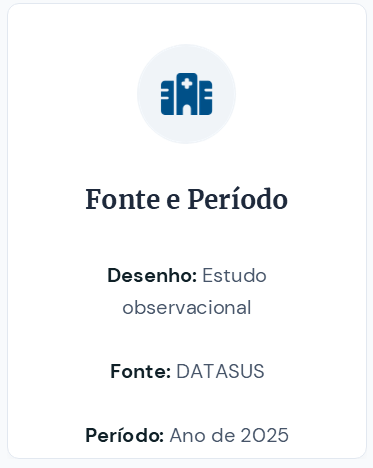

## 📋Sumário

 

:::{.columns}
:::{.column width="60%"}
:::{.fragment}
- Motivação
:::

:::{.fragment}
- Conjunto de dados
:::

:::{.fragment}
- Modelo de Cox com fragilidade
:::

:::{.fragment}
- Resultados e discussões
:::

:::{.fragment}
- Consideraçõs finais
:::

:::{.fragment}
- Principais referências
:::
:::

:::{.column width="40%"}

 

:::
:::

## 💡Motivação 

## 🗃️Conjunto de dados

 

:::{.columns}
:::{.column width="33%"}
:::{.fragment}

:::
:::

:::{.column width="33%"}
:::{.fragment}

:::
:::

:::{.column width="33%"}
:::{.fragment}

:::
:::
:::

---

## ⚙️Modelo de Cox com fragilidade

## 🗨️Resultados e discussões

## 🏁Considerações finais

## 📚Referências

- COLOSIMO, E.A; GIOLO, S.R. **Análise de sobrevivência aplicada**. 2. ed. São Paulo: Blucher, 2024.

- THERNEAU, T.M.; GRAMBSCH, P.M. **Modeling Survival Data: Extending the Cox Model**. New York: Springer, 2000.

---

## 📢 Programa de pós

 

:::{.columns}
:::{.column width="40%"}

Matemática Aplicada e Computacional

@posmac_unesp

:::

:::{.column width="60%"}

- Inscrições: 15/09 à 16/10.

- Matemática computacional e ciência de dados

- [posMAC](https://www.fct.unesp.br/#!/pos-graduacao/--matematica-aplicada-e-computacional/)

:::
:::

<!--
---

## 📢Liga acadêmica Health Tech

 

@liga_healthtech

-->

---

 

:::{.columns}
:::{.column width="50%"}
:::{.fragment}

:::
:::

:::{.column width="50%"}
:::{.fragment}

:::
:::
:::

